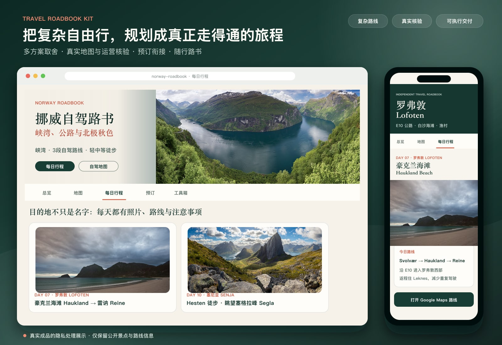

# Travel Roadbook Kit

> 从几个模糊想法开始，规划一趟路线合理、衔接顺畅、真正走得通的复杂自由行。

Travel Roadbook Kit 是一套面向复杂自由行的 Codex Skill。它会和你一起梳理同行人的偏好、时间、预算、驾驶能力、行李和已订项目，比较不同路线结构；再用真实地图、交通时刻、季节道路和运营规则逐段核验，把“看起来不错”的攻略推进到“实际走得通”的行程。

路线确认后，它还能把同一套可靠行程整理成方便多人讨论、继续预订、旅途中随时查阅和申请签证的不同材料。路书是最终呈现之一，核心价值是帮助你完成前面那段更难的规划与验证工作。

## 成品预览 / Preview



> 主图取自实际制作的挪威路书内容，展示盖朗厄尔峡湾、豪克兰海滩与 Hesten/Segla 等真实目的地；为保护隐私，已移除住宿、地址、订单与个人信息。景点照片来源及许可见路书内的 Wikimedia Commons 链接，仓库内可复现示例仍使用匿名数据。

## 它解决什么问题

旅行攻略最难的通常不是收集景点，而是把大量零散信息变成一条合理、可执行、所有同行者都能理解的路线：

- 在多个路线方案之间说明真正的得失，而不是只给景点清单
- 用真实地图和最新运营信息核验车程、轮渡、航班、季节道路与衔接时间
- 在预订后检查每晚住宿是否顺路、日期是否连续、到达时间是否合理
- 将最终行程转换成手机友好的在线或离线路书
- 生成简洁的英文签证行程，同时避免泄露无关的订单信息
- 发布或分享前检查姓名、电话、PIN、本地路径和凭证等隐私风险

## 可以产出什么

| 产出 | 适用阶段 | 主要内容 |
| --- | --- | --- |
| 路线方案对比 | 预订前 | 不同路线结构、景点取舍、交通负担、成本和风险 |
| 可预订详细行程 | 路线确定后 | 每日地点、交通、景点顺序、住宿区域和备选计划 |
| 移动端路书 | 出发前与旅途中 | 固定导航、双语地名、每日卡片、地图链接和注意事项 |
| 离线单文件 HTML | 网络不稳定时 | 无需服务器即可打开和打印的完整路书 |
| 英文签证行程 | 签证申请 | 日期、城市、景点、交通方式与住宿的简洁表格 |
| 住宿核验表 | 预订完成后 | 每晚住宿与路线、日期、入住时间和停车条件的对应关系 |

## 推荐工作流程

1. **收集约束**：航班日期、同行人数、驾驶能力、行李、预算、必去体验和已订项目。
2. **比较路线**：先形成两到三种结构明显不同的方案，并写清获得与放弃的内容。
3. **真实核验**：逐段检查地图、季节道路、运营日期、开门时间和转乘缓冲。
4. **细化预订**：按日确定交通、景点顺序、住宿区域、预约项目与天气备选。
5. **核对订单**：预订后逐晚检查住宿位置、日期、入住条件和第二天路线。
6. **生成路书**：输出移动端 HTML、离线版、打印版或英文签证行程。
7. **隐私与体验检查**：测试导航、链接、移动端阅读、打印效果和敏感信息。

## 快速开始

将 `skills/travel-roadbook` 复制到你的 Codex skills 目录，或通过 Codex 的 Skill 安装工具从本仓库安装。

然后可以这样开始：

> 使用 $travel-roadbook，根据我的机票、同行人情况和旅行偏好，先比较两套可行路线，并告诉我还缺少哪些关键信息。

从匿名示例生成离线路书：

```bash
cd skills/travel-roadbook
python3 scripts/validate_trip.py ../../examples/norway-demo-anonymized/trip.json
python3 scripts/build_roadbook.py ../../examples/norway-demo-anonymized/trip.json \
  --output ../../examples/norway-demo-anonymized/roadbook.html
python3 scripts/build_visa_itinerary.py ../../examples/norway-demo-anonymized/trip.json \
  --output ../../examples/norway-demo-anonymized/visa-itinerary.html
```

在浏览器中打开生成的 HTML；需要 PDF 时，使用浏览器的打印功能即可。

## 隐私保护

公开示例只使用虚构旅客、住宿和订单标签。请不要把以下内容提交到公开仓库：

- 护照、身份证、出生日期或签证编号
- 订单号、PIN、票号、会员账号或付款信息
- 电话、私人邮箱或私人住宅的完整地址
- 原始确认单、订单截图和住宿汇总表
- 本地电脑路径、API Key、部署 Token 或其他凭证

提交前运行：

```bash
python3 skills/travel-roadbook/scripts/privacy_scan.py .
git diff --cached
```

自动扫描只能发现常见模式，不能替代人工检查。旅行日期与精确住宿组合本身也可能暴露个人行踪，公开案例建议移动日期并使用虚构住宿。

---

## English

Travel Roadbook Kit is a Codex Skill for planning complex independent trips and verifying that they can work in the real world.

It helps reconcile group preferences, time, budget, driving limits, luggage and existing bookings; compare fundamentally different route structures; and verify each leg against real maps, schedules, seasonal roads and operator rules. Once the itinerary is sound, it can turn the same plan into a mobile roadbook, booking checklist, offline guide or visa itinerary.

### Included

- end-to-end `travel-roadbook` Skill
- route comparison and live-verification checklists
- booking-location audit and privacy rules
- JSON trip template and anonymized Norway demo
- responsive single-file roadbook generator
- concise English visa-itinerary generator
- trip-data validator and repository privacy scanner

### Important limitation

The toolkit does not guarantee live availability, prices, road openings, weather, or visa approval. Current facts must be checked against primary sources. Third-party photographs and private confirmation documents are intentionally excluded.

## License

MIT. Public map and operator links remain subject to their providers' terms.
